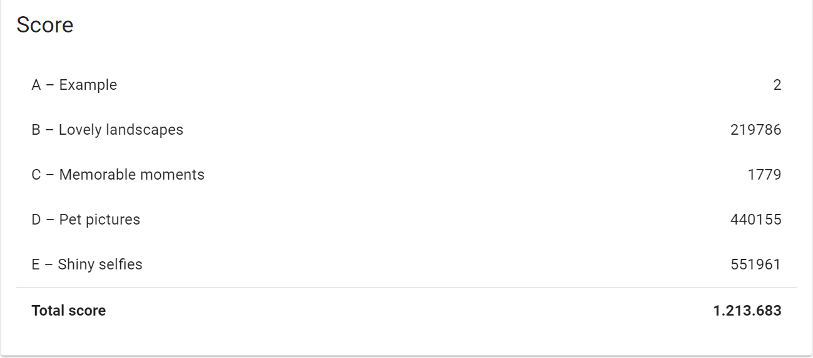
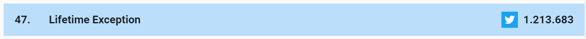

# Hashcode 2019 Qualification Round

This repository contains Lifetime Exception team solutions for Google Hashcode 2019 Qualification Round.

Hashcode is a competition conducted by Google.
There is no perfect solution for Hashcode which makes it challenging and entertaining.

This year question was about combining different photos and creating a slide show.
Every slide must contain one horizontal photo or two vertical photos.

Photos contain tags.
When we combine two vertical photos, their tags merge together.

The slideshow is scored based on how interesting the transitions between each pair of
subsequent (neighboring) slides are.


The interest factor is :
```
min( common tag number, min(slide1Tags.diff(slide2Tags), slide2Tags.diff(slide1Tags)))
// or
min( s(Slide1 ∩ Slide2), min(s(Slide1/Slide2), s(Slide2/Slide1)) )
```

Slides with common tags do not contain many different tags.

Slides with different tags do not contain common tags.

We should choose slides with half common and half different to get the highest score.

You can reach the problem definition and input files from [here](https://codingcompetitions.withgoogle.com/hashcode/archive)

## Tech/framework used
- Java 11
- Maven 3.6.0
- StreamEx 0.6.8


## Setup
Use IntelliJ or any Java IDE to open and run this project.

## Solutions

### Part-A
There is no specific solution for Part-A.

You can use any solution to solve this part.

### Part-B
PartB contains 80 000 horizontal photo.

Solution for B part is very simple.


Start selecting photo with the highest tag count which will increase the initial interest factor.
After selecting the initial photo use the greedy algorithm to select the next photo with the highest interest.
Keep continuing to select the next photo until no photo left.
This simple solution gives you gain 219 270 points.

The problem with the B part is the photos in the b_lovely_landscapes.txt files contains 840 000 unique tags
which make it very hard to calculate the Interest factor.
In order to calculate interest, we need to find a common tag number between photos.
Therefore we need to iterate over tag list every time.
A single photo can contain more than 50 tags.


This simple greedy algorithm takes 8 minutes with 8 threads.
Therefore I could not try different algorithms because of time restriction in the competition.
 
### Part-E
Part-E is the easiest among the remaining parts (C-D).
Therefore I will start with this one.


Part-E contains 80 000 vertical photo which is similar to part-B.
However, Part-E contains only 500 unique tags.

Instead of storing tags in a list and comparing them one by one, we can use BitSet with size 500 or long array which contains 8 long to represent all tags.

For example, if we have 8 unique tags we might represent it by a single byte.

```
Photo1: 10000001   //photo1 contains first and last tag 
Photo2: 00000111   //photo2 contains the last three tag 
Photo3: 11110000   //photo3 contains the first four tag 
```

We can calculate interest factor by a simple and operation between longs which represent tags.
```java
//This code can calculate the common tags between two photo with calculating only 8 long which is very fast
for (int i = 0; i < this.tagArray.length; i++) {
    commonNumber += Long.bitCount(this.tagArray[i] & other.tagArray[i]);
}
```

Part-E contains the same number of photo with Part-B.
However, the calculation for this part takes only 90 seconds which is 5 times faster than Part-B.

The solution is very similar to Part-B. The only difference is this part uses vertical photos instead of horizontal ones.
Therefore greedy algorithm selects a vertical photo with greater interest and uses it as the first photo in the slide.

After selecting the first photo we need to select another one which will complete the slide and gives the highest interest factor.


### Part-D

Part-D contains 30 000 horizontal photos and 60 000 vertical photos.
Total unique tag count is only 220 which means we can use the trick in Part-E and store all the tags by using only 4 long.

I use a different approach in this part by combining vertical photos before creating SlideShow.

The trick was combining vertical photos with a minimum number of common tags gives the highest score.

For example, if we use two photos with the same set of tags we will have a slide with a minimum tag number.
If we use two photos with a different set of tags we will have a slide with a maximum tag number.

The tag number in a given slide affect the interest factor.
Higher tag numbers give higher scores.

The solution is to create slides combining vertical photos and use a greedy algorithm to get the highest score by combining vertical and horizontal slides.

This solution will get 440 126 points and it took only 40 seconds to complete.


### Part-C

Part-C contains 500 horizontal photos and 500 vertical photos.
Total unique tag count is 2166.
Since the total photo number is only 1000 we can use any approach about tags.


The solution was used greedy and select a horizontal slide or a vertical photo with the highest interest.
In the case of selecting the single vertical photo, we need to select another one to complete a slide.

The solution will give you 1779 score and it took less than a second.


## Scoreboard

The total score in the extended round is 1.213.683.

This score placed us in the top 50 in the extended round.
With this score, you can easily enter the top ten during the competition.







## General Advice

- The competition time is limited by 4 hours. Therefore use the help of the multi-threading.
It is quite difficult to write a parallel running code during the contest.
At least try to run the same algorithm with different input files.
For example, by running the algorithm with B-C-D-E input files you can use 4 different thread and can speed up your execution by 4.
Use a powerful computer with at least 8 threads.

- After creating result files (outputs) you should upload them to Google in order to see the score.
This process is manual and takes time.
Instead of uploading every output to the server, try to calculate results in the local computer after calculation ends.
By doing that you can see the score and prevent unnecessary uploads to the server by selecting only the highest score.

- Use teamwork. Divide the parts and try to optimize the given parts. Try to prevent duplicate work and use the same set of tools and technologies if possible.

- Try to randomize given data won't change the result much. Instead of this think different approaches and optimize your algorithm.


## Contributing
Pull requests are welcome.

Please feel free to contact [me](mailto:mehmetdemircs@gmail.com) in any question.

Specially Part-B needs improvement.


## License
[MIT](https://choosealicense.com/licenses/mit/)